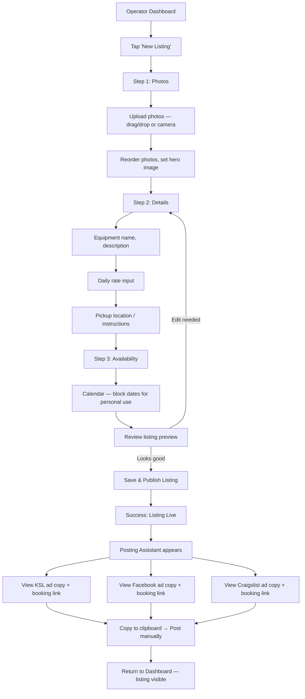
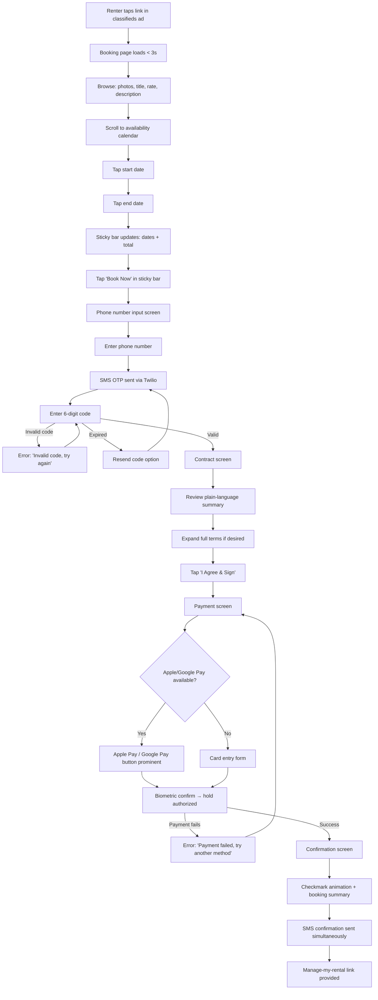
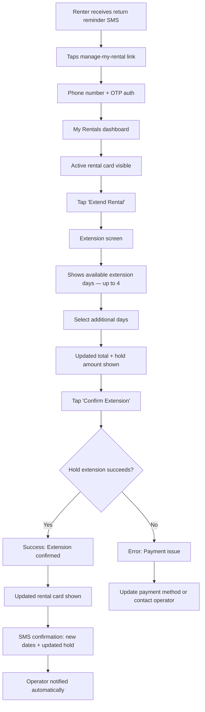
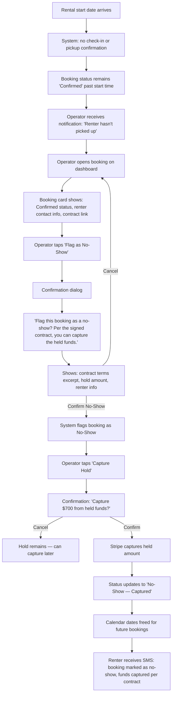
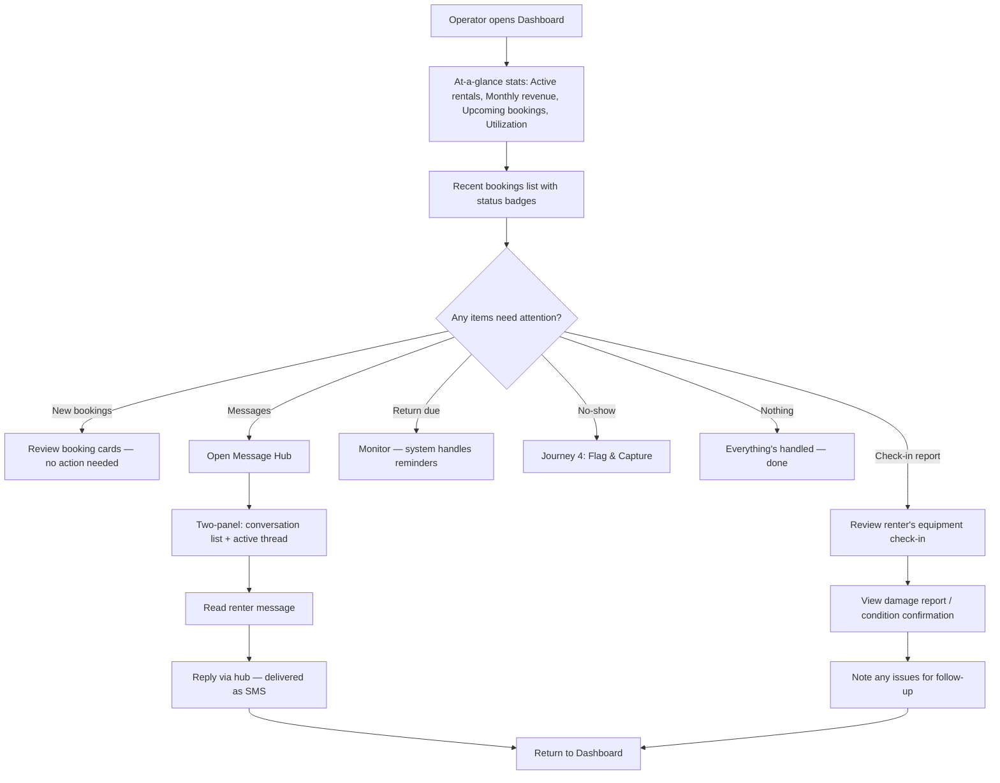
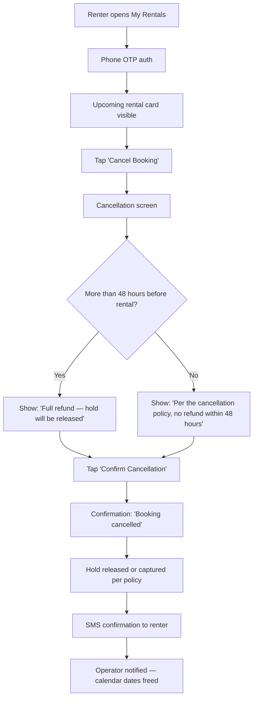
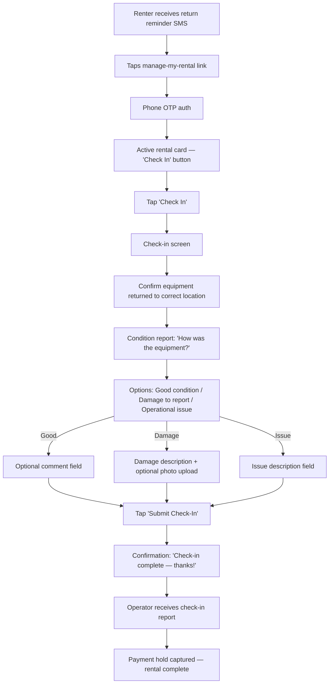

---
stepsCompleted:
  - 1
  - 2
  - 3
  - 4
  - 5
  - 6
  - 7
  - 8
  - 9
  - 10
  - 11
  - 12
  - 13
  - 14
lastStep: 14
completedAt: "2026-03-28"
inputDocuments:
  - product-brief-rentingapp-distillate.md
  - prd.md
  - implementation-readiness-report-2026-03-28.md
---

# UX Design Specification — RentingApp

**Author:** Clint
**Date:** 2026-03-28

---

## Executive Summary

### Project Vision

RentingApp is a web-based operational tool for independent equipment rental operators in Utah. It plugs into existing classifieds channels (KSL, Facebook Marketplace, Craigslist) rather than forcing operators or renters onto a new marketplace. Operators create listings once and get platform-tailored ad copy with shareable booking links. Renters click through from classifieds and land on a professional, self-service booking page — browse, book, sign, pay — all in one flow.

The product serves two radically different users through one application: operators managing their rental business from a desktop dashboard, and renters booking equipment from their phones in under three minutes.

### Target Users

**Operators (MVP: Clint)**
Independent rental operators who already rent equipment through classifieds but are buried in manual coordination — juggling texts across platforms, tracking availability in their heads, losing revenue to no-shows. Comfortable with web dashboards. Primary device: desktop/tablet for management, phone for on-the-go notifications.

**Renters**
People searching classifieds for equipment rentals. They arrive via a link in a KSL or Facebook Marketplace ad. Tech-savviness varies widely, but the bar is clear: **if they can text or order a pizza from their phone, they can use RentingApp.** They're on mobile, they want to book fast, and they need to feel confident the whole way through. No accounts to create, no passwords to remember — just their phone number.

### Key Design Challenges

1. **Trust at first click.** Renters land from a classifieds ad having never heard of RentingApp. The booking page must immediately feel professional and trustworthy — enough for someone to share their phone number, sign a contract, and authorize a payment hold. This is the make-or-break moment for conversion.

2. **Pizza-order simplicity with real-world complexity.** The booking flow involves date selection, OTP authentication, contract signing, and payment authorization. That's inherently more complex than ordering a pizza — but it must *feel* just as easy. Every step needs to feel like the obvious next thing to do, not a hurdle to clear.

3. **Two opposite design problems in one app.** The operator dashboard is desktop-optimized, information-dense, and management-focused. The renter experience is mobile-first, conversion-focused, and minimal. These need distinct design approaches sharing a cohesive product identity.

4. **Communication as a UX feature.** Great communication isn't just a nice-to-have — it's a core product value. SMS confirmations, return reminders, extension notifications, and status updates should make both renters and operators feel like they always know what's happening. No one should ever wonder "did that go through?" or "what happens next?"

### Design Opportunities

1. **The booking page IS the product for renters.** Competitors make renters text back and forth or navigate clunky marketplaces. A clean, instant-book experience from a classifieds link — with clear communication at every step — can feel like booking a hotel room instead of haggling with a stranger.

2. **SMS-native renter experience.** Renters authenticate with their phone, communicate via SMS, get reminders via SMS, and manage rentals via a link sent by SMS. This phone-native flow matches how people already interact — texting and tapping links. No app to download, no password to create.

3. **Proactive communication builds trust.** Automated confirmations, reminders, and status updates at every lifecycle moment (booking, extension, return, cancellation) eliminate uncertainty. When renters and operators always know what's happening next, the whole experience feels professional and reliable.

4. **Operator zero-effort operations.** The pipeline from listing → booking link → automated notifications → renter self-service → payment capture can run with zero manual intervention. The operator dashboard should make this visible — Clint should see the system working for him.

## Core User Experience

### Defining Experience

The core experience of RentingApp is the **renter booking flow** — the journey from tapping a classifieds link to receiving a booking confirmation SMS. This is where trust is built, value is delivered, and the product earns its place. If this flow feels like ordering a pizza on your phone, everything else follows.

For operators, the defining experience is the **zero-effort booking** — waking up to a notification that a renter found their ad, booked the equipment, signed the contract, and authorized payment, all without a single text exchanged.

### Platform Strategy

- **Renter experience:** Mobile-first responsive web. Renters arrive by tapping links in classifieds apps on their phones. No app download, no account creation, no passwords. Phone number is the identity. Every interaction is optimized for one-thumb operation on a phone screen.
- **Operator dashboard:** Desktop-optimized with functional mobile support. Primary management (listings, calendar, messages) from desktop/tablet. On-the-go notifications and quick responses from phone.
- **Application type:** Single Page Application (SPA), client-side rendered. No SEO needed — renters arrive via direct links, not search engines.
- **Browser support:** Modern browsers only (Chrome, Safari, Firefox, Edge — latest 2 versions).
- **Offline:** Not required. All interactions need connectivity.

### Effortless Interactions

These interactions must require zero thought — familiar patterns that any smartphone user already knows:

- **Availability check:** Calendar shows what's open. Green means available. Tap the dates you want. Total updates instantly. No "request to book" — what you see is what you get.
- **Authentication:** Enter your phone number, receive a code, type it in. Identical to every delivery app, banking app, and verification flow people already use daily.
- **Contract signing:** Quick scroll through clear, plain-language terms with a tap to sign. Not a legal document dump — a confirmation of what you're already agreeing to by booking.
- **Payment authorization:** Card entry and hold placement feels like saving a card on Uber or checking out on DoorDash. The hold concept is explained in one line, not a paragraph.
- **SMS lifecycle:** Booking confirmation, return reminders, extension confirmations, and cancellation notices arrive automatically via text. No one has to check a website to know what's happening — the system comes to you.
- **Rental extension:** Tap a link in an SMS → see your rental → tap "Extend" → pick days → done. A 30-second self-service action, not a negotiation.

### Critical Success Moments

**Renter — "This is better":**
The renter taps a KSL link on their phone, sees a clean booking page with photos and a live calendar, picks their dates, verifies with a text code, signs with a tap, and gets a confirmation SMS — all in under 3 minutes. They just booked a $700 equipment rental as easily as ordering a pizza. No texting strangers, no wondering if anyone saw their message, no uncertainty.

**Operator — "This is better":**
The operator checks their phone in the morning and sees a notification: new booking confirmed, contract signed, $1,050 hold authorized. They didn't exchange a single text. The calendar is already updated. The renter has pickup instructions. The system handled everything.

**Trust — "I feel safe":**
The renter lands on a page that looks professional — not a sketchy Craigslist reply. There's a real contract. There's a real payment system. There are clear terms. This feels like a legitimate business transaction, not a gamble with a stranger.

**Communication — "I always know what's happening":**
Neither the renter nor the operator ever wonders "did that go through?" or "what happens next?" Every action triggers a clear confirmation. Every upcoming event gets a reminder. The system keeps everyone informed at every step.

### Experience Principles

1. **Pizza-order simplicity.** Every interaction should feel as easy as ordering delivery on your phone. If a step feels like a hurdle, it's designed wrong. Familiar patterns over clever innovation.

2. **Communication is the product.** Proactive, clear communication at every lifecycle moment isn't a feature — it's the core value proposition. The system should make both parties feel informed and confident at all times.

3. **Trust at first sight.** The renter's first impression of the booking page determines everything. Professional appearance, clear information, and recognizable patterns (Stripe checkout, SMS verification) signal legitimacy before a single interaction.

4. **The system works so you don't have to.** Automation handles the coordination that humans are bad at — scheduling, reminders, payment capture, calendar updates. The operator's job is to own equipment. RentingApp's job is everything else.

5. **Mobile-native, not mobile-adapted.** The renter experience is designed for a thumb on a phone screen first. Desktop compatibility is a bonus, not the starting point.

## Desired Emotional Response

### Primary Emotional Goals

**Renters:** The same confidence and ease they feel ordering from DoorDash. Professional, transparent, instant — they always know what's happening next. The booking page should feel like a legitimate business, not a stranger's side hustle.

**Operators:** The feeling of having hired a competent assistant who handles all the coordination, communication, and paperwork without ever missing a beat. The system works so reliably that checking the dashboard feels calm, not anxious.

### Emotional Journey Mapping

**Renter Emotional Journey:**

| Stage | Target Emotion | Design Implication |
|-------|---------------|-------------------|
| Landing on booking page | Confidence, trust — "This is legit" | Professional visual design, clear photos, transparent pricing, recognizable payment/verification patterns |
| Browsing availability & pricing | Clarity, control — "I know exactly what I'm getting" | Live calendar with obvious available/unavailable states, total cost visible before any commitment |
| OTP authentication | Familiarity — "Oh, this is easy" | Identical pattern to delivery apps; minimal friction, no "create account" language |
| Contract signing | Security, reassurance — "This is fair and straightforward" | Plain-language terms, scannable format, quick tap-to-sign; not a wall of legalese |
| Payment hold | Comfort — "Just like saving a card on Uber" | One-line explanation of holds; Stripe's recognizable checkout UI; no surprise charges language |
| Confirmation SMS | Accomplishment, relief — "Done! That was easy" | Immediate SMS with all details; clear next steps (pickup info, manage-my-rental link) |
| Return reminder | Cared for — "They've got my back" | Timely, helpful SMS with direct link to check-in flow |

**Operator Emotional Journey:**

| Stage | Target Emotion | Design Implication |
|-------|---------------|-------------------|
| Creating a listing | Efficiency — "This is fast and clean" | Streamlined form, photo upload, minimal required fields, instant preview |
| Generating ad copy | Empowerment — "Ready to post in minutes" | One-click copy-to-clipboard, platform-specific previews |
| Receiving booking notification | Delight — "The system works!" | Clear, celebratory notification with all booking details at a glance |
| Checking the dashboard | Calm, in control — "Everything's handled" | Clean layout, status-at-a-glance, no information overload |
| No-show with captured hold | Security, fairness — "I'm protected" | Clear no-show flagging flow, one-action hold capture, contract terms referenced |

### Micro-Emotions

**Critical micro-emotions to get right:**

- **Confidence over confusion** — at every decision point, the user knows exactly what happens when they tap. No ambiguity about what a button does or what they're agreeing to.
- **Trust over skepticism** — professional design, recognizable third-party patterns (Stripe, SMS verification), and transparent terms eliminate the "is this a scam?" reflex that classifieds users carry.
- **Accomplishment over frustration** — each completed step gives clear feedback. Progress feels forward-moving, never circular or uncertain.
- **Cared-for over forgotten** — proactive communication (confirmations, reminders, status updates) makes users feel the system is watching out for them, not just processing them.

**Emotions to actively avoid:**
- Anxiety about money (unexpected charges, unclear hold amounts, hidden fees)
- Confusion about next steps ("what do I do now?")
- Feeling scammed or tricked (dark patterns, unclear terms, surprise obligations)
- Being left in the dark (no confirmation, no reminders, silence after action)
- Overwhelm (too much information, too many options, dense legal text)

### Design Implications

| Emotional Goal | UX Design Approach |
|---------------|-------------------|
| Trust at first sight | Professional typography, quality photo display, visible Stripe/security badges, clean layout with generous whitespace |
| Pizza-order familiarity | Standard mobile patterns (bottom-anchored CTAs, step indicators, inline validation), no novel UI that requires learning |
| Always informed | Confirmation screens after every action, SMS at every lifecycle event, clear status indicators throughout |
| No money anxiety | Total cost visible before commitment, hold amount explained in plain English, cancellation policy visible before booking |
| Calm operator experience | Dashboard defaults to "everything's fine" state, alerts only for items needing attention, status badges over data tables |

### Emotional Design Principles

1. **Clarity eliminates anxiety.** When users know exactly what's happening, what it costs, and what comes next, negative emotions don't have room to form. Every screen answers: "What is this? What does it cost? What happens next?"

2. **Familiar beats novel.** Using patterns people already know (SMS verification, Stripe checkout, tap-to-sign) creates instant comfort. Innovation in interaction design creates cognitive load — innovation in operational automation creates value.

3. **Silence is the enemy.** Every user action deserves acknowledgment. Every upcoming event deserves a heads-up. The system should never go quiet after a user does something important.

4. **Professional design builds trust faster than words.** A well-designed booking page communicates legitimacy more effectively than any "trust us" copy. Visual quality is the first trust signal.

5. **Celebrate the wins.** When a booking is confirmed, when a rental completes successfully, when the system handles something automatically — these moments deserve clear, positive feedback that reinforces the product's value.

## UX Pattern Analysis & Inspiration

### Inspiring Products Analysis

**Venmo — Trust Made Casual**
Venmo normalizes moving real money through an interface that feels as casual as texting. There's no anxiety in the payment flow — you enter an amount, tap send, and get instant confirmation. The UI is clean, friendly, and doesn't make you feel like you're doing something risky. For RentingApp, this teaches us that payment holds don't need to feel heavy or intimidating. Clear amounts, instant confirmation, and a casual-confident tone remove the fear from financial commitment.

**Uber / Lyft — Always Know What's Happening**
The ride-hailing experience is defined by continuous communication. From the moment you request a ride to the moment you arrive, you're never left wondering. Status updates are visual, automatic, and timely. Payment is completely invisible — it happens in the background after the service is complete. For RentingApp, this is the model for the entire rental lifecycle: booked → confirmed → rental started → return reminder → completed. Every stage communicated, every transition clear, no silence.

**Panda Express — Minimum Steps to Done**
The Panda Express ordering flow is radically simple: see the menu, tap what you want, running total visible, check out. No decisions that don't need to be made. No screens that don't earn their place. For RentingApp's booking flow, this means: see the listing, tap your dates, see the total, book. Every screen should move the renter one step closer to confirmed, with no detours.

### Transferable UX Patterns

**Payment Patterns (from Venmo + Apple Pay/Google Pay):**
- Apple Pay / Google Pay as the primary, most prominent payment option on mobile — one biometric tap to authorize a hold, no card number entry required
- Manual card entry as a secondary fallback, not the default path
- Instant visual confirmation the moment payment is authorized — no loading spinner anxiety
- Hold amount displayed clearly in plain language before and after authorization

**Communication Patterns (from Uber/Lyft):**
- Status-driven lifecycle — every rental has a clear current state visible to both parties
- Automated SMS at every transition point (booked, started, return due, completed, cancelled)
- Real-time notifications for operators — the "your driver is arriving" equivalent is "new booking confirmed"
- Progress indication throughout multi-step flows — the renter always knows where they are in the booking process

**Simplicity Patterns (from Panda Express):**
- Linear, forward-moving flow — no branching decisions during booking
- Running total always visible as the renter selects dates
- Minimal required input — only ask for what's absolutely needed at each step
- One primary action per screen — never compete for the user's attention

**Trust Patterns (from Venmo + Uber):**
- Recognizable third-party UI (Stripe Payment Element) signals security without needing to explain it
- Casual-confident tone in copy — professional but not corporate, trustworthy but not stiff
- Immediate feedback after every action — never leave the user wondering

### Anti-Patterns to Avoid

- **Manual card entry as the only payment option.** On mobile, typing a 16-digit card number is a conversion killer. Apple Pay / Google Pay must be front and center.
- **Silent transitions.** If the user does something and nothing visibly happens, trust evaporates. Every action gets a response — visual, SMS, or both.
- **Account creation walls.** Requiring a username/password/email before the user gets value. RentingApp's phone OTP model avoids this, and the UX must reinforce that there's no "account" to manage — just your phone number.
- **Information overload on mobile.** Dense dashboards, long forms, and wall-of-text contracts don't work on a phone screen. Every mobile view should pass the "can I understand this in 3 seconds?" test.
- **Hiding the cost.** Any flow where the total isn't visible until the last step creates anxiety and distrust. The renter should see the daily rate, selected days, and total cost updating in real time as they pick dates.

### Design Inspiration Strategy

**Adopt Directly:**
- Apple Pay / Google Pay as primary mobile payment via Stripe Payment Element
- SMS-driven lifecycle communication modeled on Uber's ride status updates
- Linear, forward-only booking flow with one primary action per screen
- Running cost total visible throughout date selection
- Instant visual confirmation after every user action

**Adapt for RentingApp:**
- Venmo's casual payment confidence → adapted for authorization holds (not direct charges). Clear one-line explanation: "We'll hold $700 on your card — you're only charged when the rental completes."
- Uber's real-time tracking → adapted for rental lifecycle stages. Not GPS-level real-time, but clear status communication at every transition.
- Panda Express's minimal ordering flow → adapted for a slightly longer flow (dates → auth → contract → payment) that still feels just as linear and inevitable.

**Avoid:**
- Any payment flow that requires manual card entry as the default on mobile
- Any multi-step process without a progress indicator
- Any action that doesn't produce immediate, visible feedback
- Any screen that requires scrolling to find the primary action button on mobile

## Design System Foundation

### Design System Choice

**Tailwind CSS + shadcn/ui** — a themeable, component-ownership approach where the developer controls every component directly while building on proven, accessible patterns.

### Rationale for Selection

1. **Solo developer velocity.** Tailwind is already familiar to the developer. shadcn/ui components are copy-pasted into the project (not imported from a library), meaning full ownership with no dependency lock-in. Modifications are direct code edits, not framework overrides.
2. **Professional appearance out of the box.** shadcn/ui's default aesthetic is clean, modern, and trustworthy — exactly what the renter booking page needs to establish credibility at first click. No custom design expertise required to look polished.
3. **Mobile-first by design.** Tailwind's responsive utility classes (`sm:`, `md:`, `lg:`) make it natural to design for the renter's phone screen first and scale up for the operator's desktop dashboard. This directly supports the "mobile-native, not mobile-adapted" experience principle.
4. **Lightweight and fast.** No heavy UI library bundle. Tailwind purges unused styles in production. This supports the <3 second mobile page load requirement for the renter booking page.
5. **Stripe integration compatibility.** Stripe's Payment Element can be styled with CSS variables and custom themes that align with Tailwind's design token approach, keeping the payment flow visually cohesive with the rest of the booking experience.
6. **Accessibility baseline.** shadcn/ui components are built on Radix UI primitives, which provide robust accessibility out of the box — keyboard navigation, screen reader support, ARIA attributes — meeting the PRD's accessibility requirements without additional effort.

### Implementation Approach

- **Tailwind CSS** as the utility-first styling foundation across the entire application
- **shadcn/ui** components copied into the project and customized as needed — buttons, forms, dialogs, calendars, cards, tables, tabs, toasts
- **CSS custom properties (design tokens)** for theming — colors, spacing, typography, border radius — ensuring visual consistency between renter and operator experiences
- **Radix UI primitives** (underlying shadcn/ui) for accessible interactive components — dropdowns, modals, popovers, tooltips
- **Two visual modes within one theme:**
  - Renter-facing: generous whitespace, large touch targets, prominent CTAs, minimal chrome
  - Operator-facing: denser information layout, data tables, sidebar navigation, functional density

### Customization Strategy

**Design Tokens to Define:**
- Primary brand color palette (trust-forward — blues, greens, or neutral tones that signal reliability)
- Typography scale optimized for mobile readability (16px minimum body text on mobile)
- Spacing scale that produces generous touch targets (minimum 44px tap targets per Apple HIG)
- Border radius and shadow system that feels modern and approachable
- Status colors for rental lifecycle states (confirmed, active, returning, completed, cancelled, no-show)

**Component Customizations:**
- Calendar component styled for intuitive date-range selection with clear available/unavailable/buffer states
- Card components for listing display (photo-forward, pricing prominent)
- Step indicator component for the booking flow progress
- Toast/notification components for real-time operator alerts
- SMS-style message thread component for the communication hub

**Responsive Strategy:**
- Mobile breakpoint (<768px): single-column, bottom-anchored CTAs, full-width components
- Tablet breakpoint (768px–1024px): flexible layouts, side-by-side where helpful
- Desktop breakpoint (>1024px): multi-column operator dashboard, sidebar navigation, data density

## Defining User Experience

### Defining Experience

RentingApp's defining experience is a **two-sided instant booking** — one transaction, two moments of delight:

> **Renter:** *"I tapped a link in a KSL ad and booked a $700 excavator in 3 minutes — like ordering a pizza."*

> **Operator:** *"I woke up to a notification: booking confirmed, contract signed, $700 held. I didn't lift a finger."*

These are the same event experienced from both sides. The renter's frictionless booking IS the operator's zero-effort operation. Neither moment exists without the other — and together they define everything RentingApp is.

### User Mental Model

**Renter's current mental model:**
See a classifieds ad → text the owner → wait → maybe hear back, maybe not → play phone tag for days → try to agree on a time → show up and hope the equipment is actually available → exchange cash awkwardly → hope it goes well. There's no commitment, no contract, no certainty. It feels like haggling with a stranger because it is.

**RentingApp shifts the renter's mental model to:**
See a classifieds ad → tap the link → it's a real booking page, like a hotel or Airbnb → pick dates, see the total → verify with my phone → sign, pay → done. Confirmation in my texts. It feels like a legitimate business transaction because it is.

**Operator's current mental model:**
Post an ad → get flooded with texts from multiple platforms → juggle conversations → try to track who wants what dates → turn people away manually → hope the booked renter actually shows up → lose a day's revenue on no-shows. It feels like a second job because it is.

**RentingApp shifts the operator's mental model to:**
Create a listing once → post the generated ad copy → bookings come in with contracts signed and payments held → calendar updates automatically → get notified when things happen → capture payment on completion. It feels like having an assistant because the system handles the coordination.

### Success Criteria

**The renter booking flow succeeds when:**
- Renter goes from classifieds link to confirmed booking in a single session, under 3 minutes
- Renter never wonders "what do I do next?" — every step is the obvious next action
- Renter feels confident enough to authorize a payment hold to a service they've never heard of
- Renter receives an SMS confirmation within seconds that makes them feel the booking is real and handled
- Renter could describe the process to their neighbor as "easy — like ordering food on your phone"

**The operator experience succeeds when:**
- Operator receives a booking notification with all details at a glance — no questions, no follow-up needed
- Operator's calendar is already updated — no manual action required
- Operator can see the signed contract and confirmed hold without digging
- Operator feels the system is working for them, not creating more work
- Operator never has to coordinate logistics that the system should handle

**The combined experience succeeds when:**
- Zero back-and-forth communication is needed between renter and operator to complete a booking
- Both parties feel informed at every stage of the rental lifecycle without checking a dashboard
- No double-bookings ever occur
- No-shows are financially covered by the hold, not just contractually threatened

### Novel UX Patterns

RentingApp uses **no novel UX patterns**. This is a deliberate design decision aligned with the "familiar beats novel" principle. Every interaction maps to a pattern renters and operators already know:

| Interaction | Familiar Pattern Source |
|-------------|----------------------|
| Date selection on live calendar | Airbnb, hotel booking sites |
| Phone number + OTP authentication | Uber, DoorDash, banking apps |
| Digital contract scroll-and-sign | DocuSign, insurance apps |
| Apple Pay / Google Pay tap-to-authorize | Any e-commerce checkout |
| SMS confirmations and reminders | Uber ride updates, delivery tracking |
| Manage-my-rental dashboard | Order history in any delivery app |
| Unified message inbox (operator) | Any messaging app, email |

**The innovation is not in any single interaction — it's in the elimination of the manual process.** The magic is that this entire workflow (listing → classifieds → booking → contract → payment → communication → completion) exists at all for independent equipment rental operators. No one has strung these familiar patterns together for this use case before.

### Experience Mechanics

**Renter Booking Flow — Step by Step:**

**1. Initiation — Tap the Link**
- Renter sees a classifieds ad (KSL, Facebook Marketplace, Craigslist) with professional copy and a booking link
- They tap the link on their phone
- The booking page loads in under 3 seconds

**2. Discovery — See What You're Getting**
- Hero photo(s) of the equipment, swipeable on mobile
- Equipment name, description, daily rate — all visible without scrolling
- Live availability calendar below — green/available dates are obvious, unavailable dates are clearly greyed out
- Renter taps start date, taps end date — total cost updates instantly in a sticky bottom bar
- No authentication required to browse or select dates

**3. Commitment — Verify and Book**
- Renter taps "Book Now" in the sticky bottom bar (showing selected dates + total)
- Phone number input appears — "Enter your phone number to continue"
- OTP code arrives via SMS within seconds — renter enters the 6-digit code
- Contract appears — plain-language summary of terms (rental period, daily rate, total, cancellation policy, liability) with full text expandable
- Renter taps "I Agree & Sign"
- Payment screen with Apple Pay / Google Pay button prominent, manual card entry below as fallback
- One-line hold explanation: "We'll hold $[amount] — you're only charged when the rental completes."
- Renter taps Apple Pay → Face ID / fingerprint → hold authorized

**4. Confirmation — Done, You're Booked**
- Success screen: checkmark animation, booking summary (dates, equipment, total, pickup instructions)
- SMS arrives simultaneously: "Your booking is confirmed! [Equipment] — [dates]. Pickup: [instructions]. Manage your rental: [link]"
- The manage-my-rental link is their portal for everything from here — extend, cancel, check-in

**Operator Notification Flow — Simultaneous:**

**1. Instant Alert**
- Operator receives a push notification / SMS: "New booking! [Equipment] — [dates] — $[amount] held"
- Dashboard updates in real time — new booking appears with status badge "Confirmed"

**2. At-a-Glance Details**
- Booking card on dashboard shows: renter name (from contract), dates, amount held, signed contract link
- Calendar is already blocked — no manual update needed
- No action required from operator unless they choose to message the renter

## Visual Design Foundation

### Color System

**Theme: Desert Sunset**

A warm-forward palette inspired by Utah desert sunsets — distinctive, approachable, and trustworthy. The warmth differentiates RentingApp from cold SaaS blue and signals that this is a human-centered tool built by a real operator.

**Primary Colors:**

| Token | Role | Hex | Usage |
|-------|------|-----|-------|
| `primary` | Brand primary — warm amber | `#E87B35` | Primary CTAs, active states, brand accents |
| `primary-dark` | Deeper terracotta | `#C45A2D` | Hover states, emphasis, headers |
| `primary-light` | Soft peach | `#F5C4A1` | Backgrounds, highlights, selected states |

**Secondary Colors:**

| Token | Role | Hex | Usage |
|-------|------|-----|-------|
| `secondary` | Cool slate blue | `#4A6178` | Operator dashboard accents, secondary actions, informational elements |
| `secondary-dark` | Deep twilight | `#2E3E50` | Navigation, sidebars, dark text |
| `secondary-light` | Pale sky | `#D5DEE8` | Borders, dividers, subtle backgrounds |

**Semantic Colors:**

| Token | Role | Hex | Usage |
|-------|------|-----|-------|
| `success` | Confirmed / available | `#3D9A5F` | Available dates, booking confirmed, payment captured |
| `warning` | Attention needed | `#D4952B` | Extension buffer, pending states, approaching deadlines |
| `error` | Error / unavailable | `#C4392E` | Unavailable dates, failed payments, validation errors |
| `info` | Informational | `#4A6178` | Tooltips, help text, status info (shares secondary) |

**Neutral Colors:**

| Token | Role | Hex | Usage |
|-------|------|-----|-------|
| `neutral-900` | Primary text | `#1A1A1A` | Body text, headings |
| `neutral-700` | Secondary text | `#4A4A4A` | Descriptions, labels |
| `neutral-500` | Muted text | `#7A7A7A` | Placeholders, disabled states, timestamps |
| `neutral-300` | Borders | `#D1D1D1` | Input borders, dividers, card borders |
| `neutral-100` | Subtle backgrounds | `#F5F5F5` | Card backgrounds, alternating rows, page backgrounds |
| `white` | Base | `#FFFFFF` | Content areas, inputs, cards |

**Rental Lifecycle Status Colors:**

| Status | Color | Visual Treatment |
|--------|-------|------------------|
| Confirmed | `success` green | Solid badge |
| Active (rental in progress) | `primary` amber | Solid badge |
| Return Due | `warning` gold | Solid badge with subtle pulse |
| Completed | `neutral-500` grey | Muted badge |
| Cancelled | `neutral-500` grey | Muted badge, strikethrough text |
| No-Show | `error` red | Solid badge |
| Extension Pending | `info` slate | Outlined badge |

**Calendar Date Colors:**

| State | Visual Treatment |
|-------|------------------|
| Available | White/default background, `success` green dot or subtle green tint |
| Selected (by renter) | `primary` amber fill, white text |
| Unavailable (booked) | `neutral-100` grey background, `neutral-500` grey text |
| Blocked (by operator) | `neutral-100` grey background, diagonal hatch pattern |
| Extension buffer | `warning` gold subtle tint, available but visually distinct |
| Maintenance day | `neutral-300` grey, unavailable |
| Today | Bold ring/outline |

**Color Application by Surface:**

- **Renter booking page:** Warm-forward. `primary` amber dominates CTAs and interactive elements. Generous white space with warm accents. The page should feel sunlit and inviting.
- **Operator dashboard:** Cool-balanced. `secondary` slate blue dominates the navigation and structural elements. `primary` amber reserved for actions and alerts that need attention. The dashboard should feel calm and organized.
- **SMS notifications:** Text-only, but tone mirrors the warmth — friendly, clear, concise.

**Accessibility:**
- All text-on-background combinations meet WCAG AA contrast ratio (4.5:1 for body text, 3:1 for large text)
- `primary` amber on white meets AA for large text; use `primary-dark` terracotta for small text on light backgrounds
- Error states never communicated by color alone — always paired with icons and/or text
- Focus indicators use `primary-dark` with 2px solid outline for keyboard navigation visibility

### Typography System

**Font Selection:**

| Role | Font | Weight | Rationale |
|------|------|--------|-----------|
| Headings | **Inter** | 600 (Semi-Bold), 700 (Bold) | Clean, modern, excellent readability at all sizes. Slightly warmer than geometric sans-serifs. |
| Body | **Inter** | 400 (Regular), 500 (Medium) | Same family for consistency. Optimized for screen rendering, especially on mobile. |
| Monospace (if needed) | **JetBrains Mono** | 400 | For any code-like content (booking IDs, reference numbers). |

**Rationale for single-family approach:** Inter across headings and body keeps the visual system simple for a solo developer. Weight variation creates sufficient hierarchy without managing font pairing. Inter is the shadcn/ui default, so zero configuration overhead.

**Type Scale (Mobile-First):**

| Token | Size | Line Height | Weight | Usage |
|-------|------|-------------|--------|-------|
| `display` | 28px | 1.2 | 700 | Listing title on booking page |
| `h1` | 24px | 1.3 | 700 | Page titles, section headers |
| `h2` | 20px | 1.3 | 600 | Sub-sections, card titles |
| `h3` | 18px | 1.4 | 600 | Labels, group headers |
| `body` | 16px | 1.5 | 400 | Primary body text (minimum for mobile readability) |
| `body-medium` | 16px | 1.5 | 500 | Emphasized body text, form labels |
| `small` | 14px | 1.4 | 400 | Secondary information, timestamps, captions |
| `caption` | 12px | 1.4 | 400 | Legal text, footnotes (used sparingly) |
| `price` | 24px | 1.2 | 700 | Daily rate, total cost display |

**Desktop Scale Adjustments:**
- `display`: 36px
- `h1`: 30px
- `h2`: 24px
- `price`: 28px
- All other tokens remain the same

**Typography Principles:**
- 16px minimum body text on all devices — no exceptions for mobile
- Price and cost information always uses `price` token — large, bold, impossible to miss
- Contract text uses `body` size with `small` for supplementary legal notes — never below 14px
- CTA button text: `body-medium` (16px, 500 weight) — readable inside thumb-sized tap targets

### Spacing & Layout Foundation

**Base Unit: 4px**

All spacing derives from a 4px base unit, producing an 8-point grid system. This creates consistent, harmonious spacing across all components.

**Spacing Scale:**

| Token | Value | Usage |
|-------|-------|-------|
| `space-1` | 4px | Tight internal padding (icon-to-text) |
| `space-2` | 8px | Compact padding, inline spacing |
| `space-3` | 12px | Form field internal padding |
| `space-4` | 16px | Standard component padding, gap between related elements |
| `space-6` | 24px | Section padding, gap between card content blocks |
| `space-8` | 32px | Major section spacing |
| `space-10` | 40px | Page section breaks |
| `space-12` | 48px | Large section separation, mobile sticky bar height |
| `space-16` | 64px | Page-level top/bottom padding |

**Layout: Renter Booking Page (Mobile-First)**
- Single column, full-width
- Content max-width: 480px (centered on larger screens)
- Horizontal padding: `space-4` (16px) on mobile
- Sticky bottom bar: `space-12` (48px) height with `space-4` internal padding — always visible for "Book Now" CTA with running total
- Card-based content sections with `space-6` (24px) internal padding
- `space-8` (32px) between major content blocks (photos → details → calendar → pricing)
- Touch targets: minimum 44px height (Apple HIG), minimum 48px recommended for primary CTAs
- Photo carousel: full-width bleed on mobile, 16:9 or 4:3 aspect ratio

**Layout: Operator Dashboard (Desktop — Functional & Compact)**
- Sidebar navigation: 240px fixed width, collapsible to 64px (icon-only)
- Main content area: fluid width
- Content max-width: 1200px
- Dashboard grid: 12-column with `space-4` (16px) gutters
- Card-based widgets with `space-4` (16px) internal padding — tighter than renter pages
- Data tables: `space-2` (8px) cell padding for compact rows
- Booking cards: horizontal layout with status badge, key info, and actions in a single row
- Message hub: two-panel layout (conversation list | active thread) like Slack or email clients

**Layout: Operator Dashboard (Mobile — Functional)**
- Bottom tab navigation (Listings, Bookings, Messages, More)
- Single column, full-width
- Same compact density as desktop where possible — operators expect functional, not spacious
- Booking cards stack vertically with essential info visible, expand for details

**Layout: Manage-My-Rental Dashboard (Mobile-First)**
- Single column, full-width — same max-width and padding as booking page
- Card per rental: status badge, equipment photo thumbnail, dates, key action (extend/cancel/check-in)
- Actions are prominent buttons, not hidden in menus — one tap to the next step

### Accessibility Considerations

**Color Contrast:**
- All text meets WCAG AA (4.5:1 for normal text, 3:1 for large text and UI components)
- Calendar date states use color + secondary indicator (pattern, icon, or text) — never color alone
- Status badges use color + text label — not color-coded dots without labels

**Touch & Interaction:**
- Minimum 44px touch targets on all interactive elements (buttons, links, calendar dates, form fields)
- Primary CTAs: 48px minimum height
- Adequate spacing between tap targets — minimum 8px gap to prevent mis-taps
- Focus indicators: 2px solid `primary-dark` outline on all focusable elements

**Typography & Readability:**
- 16px minimum body text on all devices
- Sufficient line height (1.4–1.5) for body text readability
- No text over images without solid background overlay or text shadow
- Contract and legal text: `body` size (16px) minimum — never hidden behind tiny font

**Screen Reader & Keyboard:**
- Semantic HTML throughout (headings, landmarks, lists, forms)
- All interactive elements keyboard accessible (shadcn/ui + Radix handles this by default)
- ARIA labels for icon-only buttons and non-text interactive elements
- Form validation errors announced to screen readers
- Calendar navigation keyboard accessible (arrow keys for date navigation)
- Skip-to-content link on all pages

## Design Direction Decision

### Design Directions Explored

Four renter booking page directions were generated and evaluated via interactive HTML mockups (`ux-design-directions.html`), along with two operator dashboard sidebar variations, SMS communication templates, and a manage-my-rental dashboard:

| Direction | Style | Key Traits |
|-----------|-------|------------|
| **A: Clean & Confident** | Hotel booking | White canvas, warm amber accents, sticky bottom bar, generous whitespace, professional trust |
| **B: Bold & Immersive** | Premium showcase | Full-bleed hero photo with text overlay, amber sticky bar, photo-dominant |
| **C: Minimal & Structured** | Efficient checkout | Information-dense sections, pricing summary upfront, Stripe-like |
| **D: Card-Forward** | App-like modular | Cards on tinted background, gradient total bar, DoorDash-like |

Two operator dashboard sidebar directions:
- **Cool Slate** — Professional, Stripe-like, neutral sidebar
- **Warm Gradient** — Brand-forward, desert sunset gradient from terracotta to twilight

### Chosen Direction

**Renter Booking Page: Direction A — Clean & Confident**

White canvas with warm amber accents. Professional, trustworthy, and immediately legible. The booking page feels like reserving a hotel room or an Airbnb — familiar, clean, and confidence-inspiring. Key elements:

- White background with generous whitespace — the page breathes
- Warm amber (`#E87B35`) reserved for CTAs, selected states, and interactive elements
- Photo hero with swipeable carousel and dot indicators
- Equipment title and daily rate visible above the fold without scrolling
- Live availability calendar with clear available/unavailable/selected states
- Sticky bottom bar showing selected dates, running total, and "Book Now" CTA — always visible
- Verified badge for trust signaling

**Operator Dashboard: Warm Gradient Sidebar**

Sidebar uses a gradient from terracotta (`#C45A2D`) to twilight (`#2E3E50`), carrying the desert sunset brand into the operator's daily workspace. Active navigation items highlighted with peach accent. The main content area remains light (`#F5F5F5`) for readability and functional density.

### Design Rationale

1. **Direction A maximizes trust.** The clean white canvas with professional typography and generous spacing is the visual language of legitimate commerce (Airbnb, hotel booking, Stripe checkout). For renters who've never heard of RentingApp, this visual approach immediately signals "this is a real business" — directly supporting the "trust at first sight" principle.

2. **Warmth without overwhelm.** Direction A uses the desert sunset amber as an accent color, not a dominant surface. This keeps the page feeling warm and distinctive without the visual intensity of Directions B or D. The amber pops where it matters — CTAs and selected states — and recedes everywhere else.

3. **Sticky bottom bar is the conversion engine.** Always-visible running total and "Book Now" button means the renter never loses context on what they're committing to. This pattern is proven in hotel booking and food delivery apps — it reduces abandonment by keeping the next action one thumb-tap away.

4. **Warm gradient sidebar creates brand cohesion.** The operator sees the desert sunset identity every time they open the dashboard. This is where the brand lives for the operator — their daily workspace. The cool slate alternative felt too generic and disconnected from the renter-facing warmth.

5. **SMS and manage-my-rental follow Direction A's principles.** Clean, clear, warm accents on actions. The SMS templates use emoji and clear formatting for scannability. The manage-my-rental dashboard uses the same card-based, action-prominent layout as the booking page — consistent experience across all renter touchpoints.

### Implementation Approach

**Renter-Facing Surfaces (Booking Page, Manage-My-Rental):**
- White base (`#FFFFFF`) with `neutral-100` section backgrounds where separation is needed
- `primary` amber for all interactive elements: buttons, selected calendar dates, links, active states
- `primary-dark` terracotta for hover states and text that needs to meet AA contrast on white
- Cards with `shadow-md` elevation and `radius-md` corners
- Sticky bottom bar with white background, subtle top border, and `primary` CTA button
- Mobile-first layout: single column, 480px max-width centered on desktop

**Operator Dashboard:**
- Warm gradient sidebar: `linear-gradient(180deg, #C45A2D, #2E3E50)`
- White text on sidebar, `primary-light` for active item highlight
- Main content area: `neutral-100` background with white cards
- `primary` amber for actionable elements and alerts
- `secondary` slate for informational elements and structural accents
- Compact spacing: `space-2` to `space-4` for data-dense views

**Shared Across All Surfaces:**
- Inter font family throughout
- Desert sunset status color system for rental lifecycle badges
- Consistent toast/notification styling with `primary` accent
- Consistent form input styling: `neutral-300` borders, `primary` focus ring

## User Journey Flows

### Journey 1: Operator Creates Listing & Posts to Classifieds

**Goal:** Operator goes from "I have equipment to rent" to "live ads on classifieds with booking links" in under 5 minutes.

**Entry Point:** Operator dashboard → "New Listing" button

**Screen-by-Screen Flow:**

| Screen | Content | Primary Action | Feedback |
|--------|---------|---------------|----------|
| **New Listing — Photos** | Photo upload area, drag/drop or device camera. Thumbnail grid of uploaded photos. | Upload photos, set hero | Photo count indicator, reorder handles |
| **New Listing — Details** | Equipment name (text), description (textarea), daily rate (currency input), pickup location (text), pickup instructions (textarea) | Fill fields, tap Next | Inline validation, character counts |
| **New Listing — Availability** | Monthly calendar view. Tap dates to block for personal use. All dates default to available. | Block dates, tap Next | Blocked dates show hatch pattern, available dates stay white |
| **Review & Publish** | Full listing preview exactly as renters will see it — photos, title, rate, description, calendar | Tap "Publish Listing" | Preview matches renter booking page layout |
| **Posting Assistant** | Three tabs (KSL / Facebook / Craigslist). Each shows: generated ad copy, unique booking link, "Copy" button | Copy ad text + link to clipboard | Toast: "Copied to clipboard!" Green checkmark on copied tabs |

**Key UX Decisions:**
- Linear 3-step flow with progress indicator (Photos → Details → Availability)
- Listing preview uses the actual renter-facing booking page layout — what you see is what they get
- Posting assistant appears immediately after publishing — no separate navigation needed
- Each platform's ad copy is pre-formatted for that platform's style and character limits
- Booking links are unique per listing, not per platform — simplifies tracking for MVP

### Journey 2: Renter Books Equipment (Primary Conversion Flow)

**Goal:** Renter goes from classifieds link tap to confirmed booking with signed contract and payment hold in under 3 minutes.

**Entry Point:** Renter taps booking link in classifieds ad on their phone

**Screen-by-Screen Flow:**

| Screen | Content | Primary Action | Feedback |
|--------|---------|---------------|----------|
| **Booking Page — Browse** | Hero photo carousel (swipeable), equipment title + daily rate above fold, description, specs | Scroll, swipe photos | No auth required — fully browsable |
| **Booking Page — Calendar** | Monthly calendar with available (white), unavailable (grey), selected (amber) dates. Sticky bottom bar appears on first date tap | Tap start date, tap end date | Running total updates instantly in sticky bar. Date range highlighted in amber |
| **Sticky Bottom Bar** | Selected dates, day count, total cost, "Book Now" button | Tap "Book Now" | Bar is always visible once dates selected |
| **Phone Verification** | "Enter your phone number to continue" — phone input with country code, "Send Code" button | Enter number, tap Send | Loading spinner → "Code sent to (XXX) XXX-XXXX" |
| **OTP Entry** | 6-digit code input (auto-advancing boxes), countdown timer (5 min), "Resend" link | Enter code | Auto-submits on 6th digit. Error shake animation on invalid code |
| **Contract** | Plain-language summary card: rental period, daily rate, total, cancellation policy (one sentence), liability (one sentence). "View Full Terms" expandable. "I Agree & Sign" button | Read summary, tap sign | Summary is 5-6 lines max. Full terms expandable but not required reading |
| **Payment** | Apple Pay / Google Pay button (large, top). Divider: "or pay with card". Stripe card input below. Hold explanation: "We'll hold $[amount] — you're only charged when the rental completes." | Tap wallet pay or enter card | Stripe Payment Element handles validation. Hold amount prominent |
| **Confirmation** | Green checkmark animation. Booking summary: equipment, dates, total held, pickup location/instructions. "Manage Your Rental" link button | View summary, save link | SMS arrives within seconds with same info + manage link |

**Key UX Decisions:**
- No auth required to browse — the renter sees everything before committing. Auth gate only at "Book Now"
- OTP auto-advances and auto-submits — minimum keystrokes
- Contract summary is human-readable, not legal-readable. Full terms available but not forced
- Apple Pay / Google Pay is the first and largest button on payment screen
- Hold explanation is one line, not a paragraph — "We'll hold $700 — you're only charged when the rental completes"
- Confirmation screen and SMS are redundant by design — the renter gets the info in both places

### Journey 3: Renter Extends Rental

**Goal:** Renter extends an active rental in under 30 seconds via self-service dashboard.

**Entry Point:** SMS return reminder link or direct manage-my-rental URL

**Screen-by-Screen Flow:**

| Screen | Content | Primary Action | Feedback |
|--------|---------|---------------|----------|
| **My Rentals** | Card per rental: thumbnail, equipment name, dates, status badge ("Active — Return Today"), action buttons | Tap "Extend Rental" | Active rental is top card, most prominent |
| **Extension** | Current rental summary (dates, amount). Available extension days shown as tappable day chips (1, 2, 3, 4 max). Unavailable days greyed with reason ("Booked" or "Maintenance"). New return date, additional cost, new total — all update live | Select days, tap Confirm | Live cost update as days are selected. Clear "before → after" comparison |
| **Confirmation** | Green checkmark. "Rental extended!" New dates, new total hold. Return to My Rentals button | View confirmation | SMS sent simultaneously with updated details |

**Key UX Decisions:**
- Extension days presented as tappable chips ("+1 day", "+2 days", etc.) — not a calendar picker. Simpler mental model for a simple action
- Cost math is transparent: "$350/day × 1 additional day = $350 more. New total: $1,050"
- If some extension days are unavailable (next booking or maintenance), they're visible but greyed with reason — no mystery about why you can't extend further
- No re-authentication for contract — the original contract covers extensions per its terms

### Journey 4: No-Show Handling

**Goal:** Operator captures held funds when a renter doesn't show up, with clear documentation trail.

**Entry Point:** Operator dashboard — booking status doesn't change to "Active" on rental start date

**Screen-by-Screen Flow:**

| Screen | Content | Primary Action | Feedback |
|--------|---------|---------------|----------|
| **Dashboard Notification** | Alert card: "Renter hasn't picked up — [Equipment] booking for today" | Tap to view booking | Amber warning indicator |
| **Booking Detail** | Full booking card: renter name, dates, amount held, signed contract link, pickup instructions. "Flag as No-Show" button (red outline) | Tap "Flag as No-Show" | Button is visible but not aggressive — it's an option, not a suggestion |
| **No-Show Confirmation** | Dialog: "Flag as no-show?" Contract terms excerpt showing cancellation/no-show policy. Hold amount. Two actions: Cancel / Confirm | Confirm or Cancel | Clear reference to signed contract terms — this isn't arbitrary, it's contractual |
| **Capture Hold** | After flagging: "Capture $[amount]?" Separate action from flagging — operator can flag now and capture later | Capture or defer | Two-step process (flag then capture) prevents accidental fund capture |
| **Resolution** | Status badge: "No-Show — Captured". Calendar dates freed. Transaction record created | Return to dashboard | Renter notified via SMS with contract reference |

**Key UX Decisions:**
- Flag and capture are two separate actions — prevents accidental charge. Operator can flag as no-show now and decide to capture later
- Contract terms are referenced in the confirmation dialog — the operator feels protected by the process, not like they're doing something adversarial
- Calendar automatically frees the dates — the operator can potentially re-book
- Renter gets an SMS notification — transparency, not silence

### Journey 5: Operator Daily Management

**Goal:** Operator checks in on their rental business in under 2 minutes — see what's happening, respond if needed, move on.

**Entry Point:** Operator opens dashboard (desktop or mobile)

**Screen-by-Screen Flow:**

| Screen | Content | Primary Action | Feedback |
|--------|---------|---------------|----------|
| **Dashboard Home** | 4 stat cards (active rentals, monthly revenue, upcoming, utilization). Recent bookings list with status badges. Notification indicators on sidebar nav items | Scan, tap items needing attention | Badge counts on Messages. Status badges color-coded per lifecycle |
| **Bookings View** | Filterable list: All / Active / Upcoming / Completed / No-Show. Each row: avatar, renter name, equipment, dates, status badge, amount | Filter, review, take action | Compact rows with horizontal layout. Status filter tabs at top |
| **Message Hub** | Two-panel on desktop (conversation list | active thread). Single-panel on mobile (list → thread). Each conversation shows: renter name, originating platform badge, last message preview, timestamp | Read and reply | Unread indicator. Platform origin badge (KSL / FB / CL). Reply sent as SMS to renter |
| **Listing Management** | Card grid of all listings. Each card: hero photo thumbnail, equipment name, daily rate, availability summary ("3 of next 7 days booked"), edit/delete actions | Edit listings, view performance | Quick-glance availability without opening each listing |
| **Contract Viewer** | Read-only signed contract. Renter name, signature timestamp, all terms. Download option | Review if needed | Immutable — clearly marked "Signed [date]" |

**Key UX Decisions:**
- Dashboard defaults to "everything's fine" — if nothing needs attention, the operator sees green/neutral status and can close the app in 30 seconds
- Notification badges on sidebar tell the operator exactly where to go — Messages (3), Bookings (1 new) — no hunting
- Message hub shows which platform the renter came from (KSL badge, FB badge) — context for the conversation
- Bookings list is filterable by status — the operator can quickly see "show me just active rentals" or "show me upcoming"

### Journey 6: Renter Cancels Booking

**Goal:** Renter cancels a booking via self-service, with refund applied per flat cancellation policy.

**Entry Point:** Manage-my-rental dashboard

**Screen-by-Screen Flow:**

| Screen | Content | Primary Action | Feedback |
|--------|---------|---------------|----------|
| **My Rentals** | Upcoming rental card with "Cancel Booking" as secondary action | Tap "Cancel Booking" | Button is secondary styling — visible but not prominent |
| **Cancellation** | Clear policy statement based on timing. If >48h: "You'll receive a full refund. Your hold of $[amount] will be released." If <48h: "Per the cancellation policy you agreed to, cancellations within 48 hours are non-refundable." Confirm button | Read policy, confirm | No ambiguity — the renter knows exactly what happens to their money before confirming |
| **Confirmation** | "Booking cancelled." Refund status. Return to My Rentals | View confirmation | SMS confirmation sent. Operator notified |

### Journey 7: Renter Equipment Check-In

**Goal:** Renter confirms equipment return and reports condition via manage-my-rental dashboard.

**Entry Point:** SMS return reminder link or manage-my-rental dashboard

**Screen-by-Screen Flow:**

| Screen | Content | Primary Action | Feedback |
|--------|---------|---------------|----------|
| **Check-In** | Equipment name + photo. "Confirm returned to [location]" checkbox. Condition selector (Good / Damage / Issue). Comment/photo area based on selection | Report condition, submit | Simple form — 3 taps for "good condition" path |
| **Confirmation** | "Check-in complete! Thanks for renting with us." Rental moves to "Completed" status | View confirmation | Operator sees check-in report on their dashboard |

### Journey Patterns

**Patterns reused across all journeys:**

| Pattern | Where Used | Implementation |
|---------|-----------|----------------|
| **Phone OTP Gate** | Renter booking, manage-my-rental, extensions, cancellations, check-ins | Same component: phone input → OTP entry → auto-submit on 6th digit. 5-minute expiry, resend option |
| **Sticky Bottom Bar** | Booking page (dates + total + CTA), extension screen (new total + confirm) | Always-visible bar anchored to bottom of viewport. Shows context (cost) + primary action |
| **Status Badge System** | Operator dashboard bookings, renter My Rentals cards | Consistent color-coded badges: Confirmed (green), Active (amber), Return Due (gold pulse), Completed (grey), Cancelled (grey strikethrough), No-Show (red) |
| **SMS Lifecycle Notifications** | Every journey transition | Automated SMS at: booking confirmed, return reminder, extension confirmed, cancellation confirmed, no-show flagged, check-in complete |
| **Confirmation Screen** | Post-booking, post-extension, post-cancellation, post-check-in | Green checkmark animation + summary of what happened + what comes next. Always paired with simultaneous SMS |
| **Two-Step Destructive Actions** | No-show (flag → capture), cancellation (review policy → confirm) | Destructive actions always require explicit confirmation with clear consequences stated before the button |

### Flow Optimization Principles

1. **Front-load browsing, gate at commitment.** Renters can browse listings, view photos, check availability, and select dates without any authentication. The OTP gate appears only at the moment of commitment ("Book Now"). This maximizes exploration and minimizes premature drop-off.

2. **One primary action per screen.** Every screen in every journey has one obvious thing to do next. The booking flow never presents competing actions. The manage-my-rental dashboard surfaces the most relevant action per rental (extend if active and return due, check-in if returned, nothing if upcoming).

3. **Transparent cost at every step.** Renters see the running total as they select dates, the hold amount before authorizing payment, the additional cost before extending, and the refund status before cancelling. No financial surprises, ever.

4. **Confirm then notify.** Every completed action produces two confirmations: an on-screen success state and an SMS. This redundancy is intentional — it satisfies both "did that work?" (screen) and "I need proof" (SMS in my texts).

5. **Operator dashboard defaults to done.** The operator's daily check-in should take 30 seconds if nothing needs attention. Stats at a glance, status badges tell the story, notification counts direct attention. The system works so the operator doesn't have to.

## Component Strategy

### Design System Components

**shadcn/ui components that map directly to RentingApp needs:**

| shadcn/ui Component | RentingApp Usage | Customization Needed |
|---------------------|-----------------|---------------------|
| **Button** | CTAs ("Book Now", "Extend", "Confirm"), secondary actions ("Cancel", "Copy") | Desert sunset theme colors, 48px min height for primary mobile CTAs |
| **Input** | Phone number, equipment name, description, daily rate, pickup location | `primary` focus ring, 44px min height on mobile |
| **Textarea** | Equipment description, pickup instructions, damage reports, comments | Same focus styling as Input |
| **Card** | Listing cards, booking cards, rental cards, stat cards | Two density variants: spacious (renter) and compact (operator) |
| **Dialog** | No-show confirmation, destructive action confirmations | Two-step destructive pattern styling |
| **Toast** | "Copied to clipboard!", success/error notifications | Desert sunset accent, positioned top-right on desktop, top-center on mobile |
| **Tabs** | Posting assistant platforms (KSL/FB/CL), booking status filters, dashboard sections | `primary` amber active indicator |
| **Badge** | Rental lifecycle status badges, notification counts, platform origin badges | Custom color map per status (confirmed/active/returning/completed/cancelled/no-show) |
| **Avatar** | Renter initials on operator booking rows | `primary-light` background, `primary-dark` text |
| **Table** | Operator booking list rows (desktop) | Compact `space-2` cell padding, hover row highlight |
| **Separator** | Content dividers on booking page, between card sections | `neutral-100` color |
| **ScrollArea** | Contract full terms view, message thread scroll | Standard scrollbar styling |
| **Tooltip** | Calendar date states (hover for details), icon explanations | Standard positioning |
| **Skeleton** | Loading states for booking page, dashboard data | Warm-tinted skeleton (`primary-light` at 30% opacity) |
| **Form** | All form flows (listing creation, phone verification, payment) | Inline validation with `error` color, success with `success` color |
| **Label** | Form field labels throughout | `body-medium` token (16px, 500 weight) |
| **Checkbox** | Equipment check-in "Confirm returned to location" | `primary` checked state |
| **RadioGroup** | Equipment condition selector (Good/Damage/Issue) | Card-style radio options, not tiny circles |
| **Sheet** | Mobile navigation panel, filter panels on mobile | Slide from bottom on mobile |
| **DropdownMenu** | Listing actions (edit/delete), booking actions | Standard positioning and animation |
| **Popover** | Calendar month navigation, info tooltips | Standard positioning |

### Custom Components

The following components don't exist in shadcn/ui and must be built custom for RentingApp's specific needs:

#### 1. Availability Calendar

**Purpose:** Interactive date-range picker showing real-time equipment availability. The most critical renter-facing component — it's where browsing becomes commitment.

**Usage:** Renter booking page (date selection), operator listing creation (block dates), operator dashboard (calendar view)

**Anatomy:**
- Month/year header with prev/next navigation arrows
- 7-column day-of-week header (S M T W T F S)
- Date grid: 6 rows × 7 columns
- Each date cell: number + visual state indicator

**States per Date Cell:**

| State | Visual | Interactive | Context |
|-------|--------|------------|--------|
| Available | White background, `neutral-900` text, subtle `success` green dot | Tappable, hover shows `primary-light` bg | Renter: can select. Operator: can block |
| Selected (start) | `primary` amber fill, white text, left-rounded | Tappable to deselect | Renter: first day of range |
| Selected (range) | `primary-light` peach fill, `primary-dark` text | Part of selection | Renter: days between start and end |
| Selected (end) | `primary` amber fill, white text, right-rounded | Tappable to deselect | Renter: last day of range |
| Unavailable (booked) | `neutral-100` grey bg, `neutral-300` text | Not tappable, cursor: default | Another renter has booked these dates |
| Blocked (operator) | `neutral-100` grey bg, diagonal hatch pattern, `neutral-300` text | Not tappable (renter) / tappable to unblock (operator) | Operator reserved for personal use |
| Extension buffer | `warning` gold subtle tint, `neutral-700` text | Tappable (by extending renter only) | Available for extension within 4-day window |
| Maintenance | `neutral-300` bg, `neutral-500` text, wrench icon | Not tappable | 1-day mandatory buffer after rental |
| Today | Bold `primary-dark` ring/outline around cell | Same as underlying state | Current date indicator |
| Past | `neutral-100` bg, `neutral-300` text | Not tappable | Dates that have passed |

**Variants:**
- **Renter mode:** Date-range selection. Tap start date, tap end date. Running total updates in sticky bar below.
- **Operator mode (create/edit):** Tap dates to toggle blocked/available. Multi-select for blocking ranges.
- **Operator mode (view):** Read-only with booking details on hover/tap per date. Shows renter name for booked dates.

**Accessibility:**
- Arrow keys navigate between dates
- Enter/Space selects date
- Screen reader announces: "[Date], [state]" (e.g., "April 11, available" or "April 13, booked")
- Month navigation via keyboard
- Current selection announced as range: "Selected April 11 to April 12, 2 days, $700"

**Responsive Behavior:**
- Mobile: Full-width, 44px minimum cell height for tap targets
- Desktop: Centered within content area, slightly smaller cells acceptable

#### 2. Sticky Bottom Bar

**Purpose:** Persistent booking context and primary CTA anchored to the bottom of the viewport. The conversion engine.

**Usage:** Renter booking page (dates + total + "Book Now"), extension screen (new total + "Confirm Extension")

**Anatomy:**
- Left side: contextual info (selected dates, day count, total cost)
- Right side: primary action button
- Top border: 1px `neutral-100` separator
- Background: white with subtle shadow upward

**States:**

| State | Content | Button |
|-------|---------|--------|
| **Hidden** | No dates selected yet | Not visible — appears on first date selection |
| **Partial** | Start date selected, no end date | "Select return date" | Button disabled, muted |
| **Ready** | Date range selected | "Apr 11 – 12 (2 days)" / "$700" | "Book Now" — `primary` amber, active |
| **Processing** | Booking in progress | Same info | Button shows spinner, disabled |
| **Extension mode** | Extension context | "1 additional day" / "+$350 (new total: $1,050)" | "Confirm Extension" — `primary` amber |

**Accessibility:**
- `role="status"` with `aria-live="polite"` — screen reader announces total changes
- Button always keyboard-focusable when visible
- Cost information readable without visual formatting

**Responsive Behavior:**
- Mobile: Full-width, fixed to bottom. 60px height. Safe area padding for notched phones
- Desktop: Same component, max-width matches content area (480px), centered

#### 3. OTP Input

**Purpose:** 6-digit one-time password entry for phone verification. Must feel instant and familiar.

**Usage:** All renter authentication points — booking, manage-my-rental, extensions, cancellations, check-in

**Anatomy:**
- 6 individual digit boxes in a row
- Auto-advancing focus on digit entry
- Countdown timer (5:00 remaining)
- "Resend code" link (appears after 30 seconds)
- Phone number display: "Code sent to (801) XXX-XXXX"

**States:**

| State | Visual | Behavior |
|-------|--------|----------|
| **Empty** | 6 outlined boxes, first focused | Cursor in first box |
| **Entering** | Filled boxes show digits, next box focused | Auto-advance on each digit |
| **Complete** | All 6 filled | Auto-submit immediately — no "Verify" button needed |
| **Verifying** | Boxes show loading shimmer | Submitting to server |
| **Success** | Boxes flash `success` green briefly | Transitions to next screen |
| **Error** | Boxes shake animation, border turns `error` red | Clears input, refocuses first box. Error text below: "Invalid code, try again" |
| **Expired** | Timer shows "Code expired" | "Resend code" link becomes prominent |

**Accessibility:**
- Single `input` element with `inputmode="numeric"` and `autocomplete="one-time-code"` for mobile autofill
- Screen reader: "Enter 6-digit verification code. Code sent to (801) XXX-XXXX"
- Timer announced at 1 minute and 30 seconds remaining

#### 4. Contract Summary Card

**Purpose:** Human-readable rental agreement summary with expandable full terms. Must feel approachable, not intimidating.

**Usage:** Booking flow (between OTP verification and payment)

**Anatomy:**
- Summary section (always visible): 5-6 line plain-language overview
  - Rental period and dates
  - Daily rate and total
  - Cancellation policy (one sentence)
  - Liability summary (one sentence)
  - No-show policy (one sentence)
- "View Full Terms" expandable section
- "I Agree & Sign" button at bottom
- Signature line: "Signed by [phone number] on [date/time]"

**States:**

| State | Visual | Behavior |
|-------|--------|----------|
| **Collapsed** | Summary visible, "View Full Terms" link at bottom | Default state — renter sees summary only |
| **Expanded** | Full legal text visible below summary | Smooth accordion animation. Scroll within section |
| **Signed** | Green checkmark replaces button, signature timestamp shown | Transitions to payment screen |

**Content Guidelines:**
- Summary uses conversational language: "You're renting for 2 days (Apr 11–12) at $350/day = $700 total"
- Cancellation in one line: "Cancel 48+ hours before for a full refund. Within 48 hours, the hold is non-refundable."
- Full terms are complete legal text but never forced on the renter

**Accessibility:**
- Summary text uses `body` (16px) size — never smaller
- Full terms in expandable region with `aria-expanded` attribute
- "I Agree & Sign" button clearly labeled with action consequence

#### 5. Booking Card

**Purpose:** Compact representation of a booking used across operator dashboard and renter's My Rentals. The most-viewed component in the system.

**Usage:** Operator dashboard (booking list), operator bookings view, renter My Rentals dashboard

**Anatomy:**
- Left: avatar (renter initials) or thumbnail (equipment photo)
- Center: primary info (name, equipment, dates)
- Right: status badge + amount
- Bottom (expandable on mobile): action buttons

**Variants:**

| Variant | Context | Content | Actions |
|---------|---------|---------|--------|
| **Operator — list row** | Dashboard, bookings view | Avatar, renter name, equipment, dates, status badge, amount | View details, message renter |
| **Operator — detail** | Expanded booking view | Full info + contract link + check-in report + payment status | Flag no-show, capture hold, message |
| **Renter — active** | My Rentals | Thumbnail, equipment name, dates, status, total | Extend Rental, Check In, Cancel |
| **Renter — upcoming** | My Rentals | Thumbnail, equipment name, dates, status, total | Cancel Booking |
| **Renter — completed** | My Rentals | Thumbnail, equipment name, dates, status, total | No actions (view only) |

**Status Badge Colors (reused from design tokens):**

| Status | Badge Style |
|--------|------------|
| Confirmed | `success` green solid |
| Active | `primary` amber solid |
| Return Due | `warning` gold solid + subtle pulse animation |
| Completed | `neutral-500` grey muted |
| Cancelled | `neutral-500` grey + strikethrough on dates |
| No-Show | `error` red solid |
| No-Show — Captured | `error` red solid + "Captured" sub-label |

**Responsive Behavior:**
- Desktop (operator): Horizontal single row — all info + status + amount on one line
- Mobile (operator): Stacked — info on top, status + amount below, actions on tap/expand
- Mobile (renter): Card layout — thumbnail left, info right, actions as full-width buttons below

#### 6. Message Thread

**Purpose:** SMS-style conversation view between operator and renter in the communication hub.

**Usage:** Operator message hub (active thread panel)

**Anatomy:**
- Thread header: renter name, phone number, platform origin badge (KSL/FB/CL)
- Message bubbles: inbound (renter, left-aligned, grey) and outbound (operator, right-aligned, `primary` amber)
- Timestamp separators between message groups
- Input bar at bottom: text input + send button
- Auto-scroll to latest message

**States:**

| State | Visual |
|-------|--------|
| **Empty** | "No messages yet — renter booked directly" |
| **Active** | Message bubbles with timestamps. Newest at bottom |
| **Typing** | Input focused, send button enabled when text present |
| **Sent** | Outbound bubble appears immediately with "Sending..." then "Sent" indicator |
| **Failed** | Outbound bubble shows `error` red indicator + "Retry" link |

**Accessibility:**
- Messages in `role="log"` container with `aria-live="polite"`
- Each message: sender, content, timestamp readable by screen reader
- Input: `aria-label="Reply to [renter name]"`

#### 7. Photo Carousel

**Purpose:** Swipeable equipment photo gallery on the booking page. The first visual impression.

**Usage:** Renter booking page hero area, listing preview

**Anatomy:**
- Full-width photo display
- Swipe/drag on mobile, arrow buttons on desktop
- Dot indicators showing position (current dot = `primary` amber)
- Photo counter: "2 / 4"

**States:**

| State | Visual |
|-------|--------|
| **Single photo** | No dots, no arrows — just the image |
| **Multiple photos** | Dots below image, swipeable. Arrows on desktop hover |
| **Loading** | Skeleton placeholder with warm-tinted shimmer |
| **Error** | Grey placeholder with camera icon |

**Responsive:**
- Mobile: Full-width bleed, 16:9 aspect ratio, swipe gesture
- Desktop: Constrained to content max-width, arrow buttons on hover

#### 8. Platform Badge

**Purpose:** Small indicator showing which classifieds platform a renter or message originated from.

**Usage:** Operator message hub (conversation list), booking cards

**Anatomy:** Small pill with platform icon/abbreviation and name

**Variants:**

| Platform | Label | Color |
|----------|-------|-------|
| KSL Classifieds | "KSL" | `#1A7FC4` blue |
| Facebook Marketplace | "FB" | `#1877F2` blue |
| Craigslist | "CL" | `#5A1A8A` purple |

### Component Implementation Strategy

**Build Order (aligned with journey priority):**

**Phase 1 — Renter Booking Flow (Journey 2):**
These components are needed for the primary conversion flow and must be built first:
1. Photo Carousel — first impression
2. Availability Calendar (renter mode) — date selection
3. Sticky Bottom Bar — conversion CTA
4. OTP Input — authentication gate
5. Contract Summary Card — agreement signing

**Phase 2 — Operator Core (Journeys 1 & 5):**
6. Booking Card (operator variant) — dashboard backbone
7. Message Thread — communication hub
8. Platform Badge — conversation context
9. Availability Calendar (operator mode) — listing creation

**Phase 3 — Renter Self-Service (Journeys 3, 6, 7):**
10. Booking Card (renter variant) — My Rentals dashboard
11. Sticky Bottom Bar (extension variant) — extension flow

**Phase 4 — Edge Cases (Journey 4):**
12. Booking Card (detail variant with no-show actions) — no-show handling

**Implementation Principles:**
- All custom components built with Tailwind utility classes on standard HTML elements
- Design tokens (CSS custom properties) used for all colors, spacing, and typography — no hardcoded values
- Each component is a single React component file (or equivalent) with all states handled internally
- shadcn/ui primitives (Radix) used for accessible foundations where applicable (e.g., calendar uses Radix's day picker primitives, dialogs use Radix dialog)
- Mobile-first responsive behavior — start with the phone layout, add desktop enhancements with Tailwind breakpoint utilities

## UX Consistency Patterns

### Button Hierarchy

**Three-tier button system used consistently across all surfaces:**

| Tier | Style | Usage | Examples |
|------|-------|-------|----------|
| **Primary** | `primary` amber fill, white text, `radius-md`, 48px height on mobile | One per screen. The single most important action. | "Book Now", "Confirm Extension", "Publish Listing", "I Agree & Sign" |
| **Secondary** | `neutral-100` fill, `neutral-700` text, `radius-md`, 44px height | Supporting actions alongside a primary. | "Cancel Booking", "Check In", "Copy to Clipboard" |
| **Ghost/Text** | No fill, `primary` text, underline on hover | Tertiary actions, links, navigation. | "View Full Terms", "Resend Code", "View All", "Edit" |

**Button Rules:**
- Never more than one primary button visible on a screen at the same time
- Primary buttons always use verb phrases: "Book Now", "Confirm Extension" — not "Submit" or "OK"
- Destructive actions (cancel booking, flag no-show) use `error` red outline style, never primary amber
- Loading state: button text replaced with spinner, button disabled, width preserved (no layout shift)
- Disabled state: 50% opacity, `cursor: not-allowed`
- All buttons have `:focus-visible` outline using `primary-dark` 2px solid for keyboard navigation

**Mobile-Specific:**
- Primary buttons in sticky bars: full width minus padding
- Action buttons in rental cards: full width, stacked vertically
- Minimum touch target: 48px primary, 44px secondary

### Feedback Patterns

#### Success Feedback

| Context | Feedback Type | Details |
|---------|--------------|--------|
| Booking confirmed | Screen + SMS | Green checkmark animation → summary screen. SMS sent simultaneously |
| Extension confirmed | Screen + SMS | Green checkmark → updated rental card. SMS with new dates/total |
| Cancellation confirmed | Screen + SMS | Confirmation screen with refund status. SMS confirmation |
| Check-in submitted | Screen + SMS | "Check-in complete!" screen. Operator notified |
| Listing published | Screen + Toast | Redirect to posting assistant. Toast: "Listing published!" |
| Ad copy copied | Toast | "Copied to clipboard!" toast with green checkmark, auto-dismiss 3s |
| Hold captured | Screen | Status badge updates to "No-Show — Captured". Inline confirmation |

**Success Pattern Rule:** Every action that changes state produces immediate visual feedback on screen AND an SMS notification to the relevant party. No silent successes.

#### Error Feedback

| Context | Feedback Type | Details |
|---------|--------------|--------|
| Invalid OTP | Inline | Shake animation on input boxes, border turns `error` red, "Invalid code, try again" text below. Input cleared, first box refocused |
| OTP expired | Inline | Timer shows "Code expired" in `error` red. "Resend code" link becomes prominent primary-styled button |
| Payment failed | Inline | Error message below payment form: "Payment failed — please try another method." Payment form remains, no page reload |
| Form validation | Inline | `error` red border on invalid field, error message directly below field. Shows on blur (not on keystroke). Error icon (⚠) + text |
| SMS delivery failure | Operator notification | Operator dashboard toast: "SMS to [renter] failed to send. Message saved — retry?" |
| Network error | Toast | "Connection lost. Your progress is saved — we'll retry when you're back online." |
| Double-booking race condition | Inline | "Sorry, these dates were just booked. Please select different dates." Calendar refreshes to show updated availability |

**Error Pattern Rules:**
- Errors appear inline, next to the element that caused them — never in a separate page or alert box
- Error messages are human-readable: "Payment failed — try another method" not "Error code: STRIPE_DECLINE_4242"
- Errors never clear the user's valid input — only the invalid field is affected
- All errors provide a recovery action: retry, try different input, or contact support
- `error` red is always paired with text and/or icon — never color alone

#### Warning Feedback

| Context | Feedback Type | Details |
|---------|--------------|--------|
| Cancellation within 48h | Inline | Yellow/amber warning box: "Per the cancellation policy, no refund within 48 hours." Shown before confirm button |
| Extension day unavailable | Inline | Day chip greyed with tooltip: "Booked" or "Maintenance day" |
| Stripe hold nearing expiry | Operator notification | Dashboard alert: "Hold for [booking] expires in 24 hours. Action needed." |
| Renter hasn't picked up | Operator notification | Dashboard card: "Renter hasn't picked up — [Equipment] booking for today" |

**Warning Pattern Rule:** Warnings inform but don't block. The user can still proceed (or not) with full knowledge of consequences.

#### Informational Feedback

| Context | Feedback Type | Details |
|---------|--------------|--------|
| Hold explanation | Inline text | One line below payment: "We'll hold $[amount] — you're only charged when the rental completes." |
| Cancellation policy | Inline text | One line on contract summary: "Cancel 48+ hours before for a full refund." |
| Extension availability | Inline text | "You can extend up to 4 additional days" on extension screen |
| Past rental visibility | Inline text | "Past rentals visible for 45 days" on My Rentals (if approaching cutoff) |

**Info Pattern Rule:** Informational text uses `neutral-500` color and `small` (14px) size. Present but not competing with primary content.

### Form Patterns

**Consistent form behavior across all input flows:**

#### Input States

| State | Visual Treatment |
|-------|------------------|
| **Default** | `neutral-300` border, white background, `neutral-500` placeholder text |
| **Focused** | `primary` amber border (2px), subtle `primary-light` background tint |
| **Filled** | `neutral-300` border, `neutral-900` text, white background |
| **Error** | `error` red border (2px), `error` red text below field, ⚠ icon |
| **Disabled** | `neutral-100` background, `neutral-300` text, `cursor: not-allowed` |
| **Success** | `success` green border briefly on valid submission, ✓ icon (forms only, not every field) |

#### Validation Rules

- **When to validate:** On blur (when user leaves the field), not on every keystroke. Exception: OTP auto-submits on completion
- **Required fields:** Indicated by absence of "(optional)" label — all fields assumed required unless marked otherwise. No red asterisks
- **Error placement:** Directly below the field, left-aligned, `error` red, `small` (14px) size
- **Error copy:** Specific and helpful. "Enter a valid phone number" not "Invalid input". "Daily rate must be at least $1" not "Validation error"

#### Form Layout Rules

- Labels above inputs (never inline/floating on mobile — readability first)
- One input per row on mobile (stacked vertically)
- Related fields can be side-by-side on desktop (e.g., start date / end date)
- Submit button always at the bottom, full-width on mobile
- Form progress survives page refresh — state persisted in URL or session storage (booking flow requirement from PRD)

#### Specific Form Patterns

**Phone Number Input:**
- Country code pre-filled (+1 for US/Utah market)
- Auto-format as user types: (801) 555-1234
- `inputmode="tel"` for mobile number keyboard
- "Send Code" button enabled only when valid 10-digit number entered

**Currency Input (Daily Rate):**
- Dollar sign prefix outside the input (visual only, not editable)
- `inputmode="decimal"` for number keyboard with decimal
- Auto-format to 2 decimal places on blur
- Minimum $1.00 validation

**Photo Upload:**
- Drag-and-drop zone on desktop, tap to open camera/gallery on mobile
- Accept: JPEG, PNG, WebP. Max: 10MB per photo
- Thumbnail preview grid with reorder handles (drag on desktop, long-press on mobile)
- "Set as hero" action on first photo by default, changeable
- Upload progress indicator per photo

### Navigation Patterns

#### Renter Navigation

**No persistent navigation.** Renters arrive via a direct booking link and move through a linear flow. There is no global nav bar, no hamburger menu, no "explore" section. Each screen has:
- Back arrow (top-left) to return to previous step — except the booking page landing (no back, it's the entry point)
- Progress indicator during booking flow (step dots: Dates → Verify → Contract → Payment → Confirmed)
- Sticky bottom bar for primary CTA during date selection

**Manage-My-Rental navigation:**
- Simple header: "RentingApp" logo + "My Rentals" label
- No sidebar, no tabs — just a list of rental cards
- Each card opens into detail/action views with back navigation

#### Operator Navigation

**Desktop: Persistent sidebar**
- Fixed left sidebar (240px), collapsible to 64px icon-only
- Sections: Dashboard, Listings, Bookings, Messages, Contracts, Settings
- Active item: `primary-light` background highlight, left border accent
- Notification badges on items with pending actions (Messages: 3, Bookings: 1 new)
- Logo at top of sidebar

**Mobile: Bottom tab bar**
- 4 tabs: Listings, Bookings, Messages, More
- More → Settings, Contracts
- Active tab: `primary` amber icon + label
- Badge dots for notifications
- Tab bar height: 56px + safe area bottom padding

**Navigation Rules:**
- Sidebar/tabs persist across all operator views — never hidden
- Deep links work: a notification link to a specific booking opens that booking, not the dashboard
- Browser back button always works predictably — no SPA routing surprises
- Current location always clear from sidebar highlight or tab state

### Loading States

| Context | Pattern | Details |
|---------|---------|--------|
| **Booking page initial load** | Skeleton screens | Warm-tinted skeleton placeholders for photo, title, calendar. Matches layout of final content. Must resolve in <3 seconds |
| **Calendar data refresh** | Inline skeleton | Calendar grid shows skeleton cells while fetching updated availability. Must resolve in <5 seconds |
| **OTP submission** | Input shimmer | OTP boxes show subtle shimmer while verifying. No full-page loader |
| **Payment processing** | Button spinner | "Book Now" button shows spinner, remains full-width. Copy below: "Placing hold..." |
| **Dashboard data** | Skeleton cards | Stat cards and booking rows show skeleton placeholders. Progressive reveal as data loads |
| **Message sending** | Optimistic UI | Message bubble appears immediately as "Sending..." then confirms "Sent" or shows retry on failure |
| **Photo upload** | Progress bar | Individual progress bar per photo. Thumbnail appears when upload completes |

**Loading Rules:**
- Never show a blank screen — always show skeleton or placeholder content
- Never show a full-page spinner — always show contextual loading in the component that's loading
- Skeleton shapes match the final content layout — prevents layout shift on load
- Optimistic UI for actions where the outcome is almost always success (message sending, copy to clipboard)

### Empty States

| Context | Message | Action |
|---------|---------|--------|
| **No listings** (operator) | "You haven't created any listings yet. List your first piece of equipment and start getting bookings." | "Create Listing" primary button |
| **No bookings** (operator) | "No bookings yet. Once you post your listing on classifieds, bookings will appear here." | "View Listings" link |
| **No messages** (operator) | "No messages yet. When renters reach out, conversations will appear here." | None — informational only |
| **No rentals** (renter My Rentals) | "You don't have any rentals. Find equipment on KSL or Facebook Marketplace to get started." | None — renters arrive via classifieds, not this page |
| **No search results** (operator bookings filter) | "No bookings match this filter." | "Clear filters" link |

**Empty State Rules:**
- Always include a brief explanation of why it's empty and what will fill it
- Include an action CTA when the user can directly fix the empty state
- Use a simple illustration or icon — not a complex graphic. Keep it lightweight
- Tone: helpful and forward-looking, never apologetic or negative

### Micro-Interaction Patterns

| Interaction | Animation | Duration | Purpose |
|-------------|-----------|----------|---------|
| **Date selection on calendar** | Cell fill color transition | 150ms ease | Immediate tactile feedback on tap |
| **Sticky bar appear** | Slide up from bottom | 200ms ease-out | Appear when dates first selected |
| **Sticky bar total update** | Number counter animation | 300ms | Draws attention to cost change |
| **Booking confirmation checkmark** | Draw-on animation (circle → checkmark) | 600ms | Celebration of successful booking |
| **OTP error shake** | Horizontal shake (3 cycles) | 400ms | Clear signal that code was wrong |
| **Toast appear/dismiss** | Slide in from top, fade out | 200ms in, 150ms out, 3s visible | Non-intrusive notification |
| **Status badge pulse** (Return Due) | Subtle scale pulse (1.0 → 1.05) | 2s loop, ease-in-out | Draws attention without alarm |
| **Card hover** (desktop) | Subtle shadow increase | 150ms | Interactive element affordance |
| **Button press** | Scale down to 0.97 | 100ms | Tactile press feedback |
| **Photo carousel swipe** | Physics-based momentum | Variable | Natural swipe feel |
| **Accordion expand** (contract terms) | Height auto-animate | 250ms ease | Smooth content reveal |

**Animation Rules:**
- All animations respect `prefers-reduced-motion` — reduced to instant transitions for users who need it
- No animation longer than 600ms — keep everything snappy
- Entrance animations: ease-out (fast start, gentle finish)
- Exit animations: ease-in (gentle start, fast exit)
- Interactive feedback (press, hover): under 150ms — must feel instant
- Never animate something that blocks the user from taking their next action

### Copy & Tone Patterns

**Voice:** Casual-confident. Professional but not corporate. Friendly but not cutesy. Like talking to a competent friend who handles things.

| Context | Tone | Example |
|---------|------|---------|
| **CTA buttons** | Direct, action-oriented | "Book Now", "Extend Rental", "Confirm" — not "Submit", "Proceed", "Continue" |
| **Success messages** | Celebratory, brief | "You're booked! ✅", "Rental extended!", "Check-in complete!" |
| **Error messages** | Helpful, specific | "Payment failed — try another method" not "An error occurred" |
| **Warnings** | Clear, consequence-stated | "Cancellations within 48 hours are non-refundable" |
| **Informational** | Simple, jargon-free | "We'll hold $700 — you're only charged when the rental completes" |
| **Empty states** | Encouraging, forward-looking | "No bookings yet. Once you post your listing, bookings will appear here." |
| **SMS notifications** | Concise, emoji-accented | "✅ Booking Confirmed! Mini Excavator — Apr 11–12. Manage: [link]" |

**Copy Rules:**
- Max one sentence for any inline feedback or status message
- All financial amounts include the dollar sign and comma formatting: "$1,050" not "1050"
- Dates always formatted as "Apr 11" or "Apr 11–12" — short month, no year unless crossing year boundary
- Time always formatted as "7:00 AM" — 12-hour with AM/PM
- Never use technical jargon: "hold" not "authorization", "refund" not "release", "sign" not "execute"
- SMS messages stay under 160 characters when possible (single SMS segment)

## Responsive Design & Accessibility

### Responsive Strategy

**RentingApp serves two fundamentally different responsive strategies in one application:**

**Renter Experience — Mobile-First**
Renters arrive by tapping links on their phones from classifieds apps. Mobile is the primary (and often only) device. Design starts at 375px and scales up.

| Viewport | Layout | Behavior |
|----------|--------|----------|
| **Mobile (< 768px)** | Single column, 100% width, 16px horizontal padding. Content max-width 480px centered on larger phones. Sticky bottom bar for CTA. No persistent navigation — linear flow with back arrows. | Primary target. Every screen must be fully functional here. |
| **Tablet (768px – 1023px)** | Same single column, more generous whitespace. Content max-width 480px centered. Booking page unchanged — the mobile layout works perfectly at this size. | No special tablet layout for renter pages — mobile layout with breathing room. |
| **Desktop (≥ 1024px)** | Content centered in 480px max-width column with generous margins. Photo carousel constrained to content width. Looks like a mobile app preview on desktop. | Functional but not the design target. Renters CAN book from desktop but most won't. |

**Operator Experience — Desktop-Optimized, Mobile-Functional**

| Viewport | Layout | Behavior |
|----------|--------|----------|
| **Desktop (≥ 1024px)** | Persistent left sidebar (240px, collapsible to 64px). Main content area: fluid width, 1200px max-width. 12-column grid with 16px gutters. Two-panel message hub. Compact data tables. | Primary target. Operator manages business here. |
| **Tablet (768px – 1023px)** | Sidebar collapsed to icon-only (64px) by default. Main content fills remaining width. Message hub single-panel with toggle. Data tables horizontally scrollable if needed. | Functional for on-the-go management. |
| **Mobile (< 768px)** | No sidebar. Bottom tab bar (Listings, Bookings, Messages, More). Single column layout. Booking cards stack vertically. Message hub is list → thread navigation. | Quick checks and responses. Not primary management device. |

### Breakpoint Strategy

**Tailwind CSS breakpoints (mobile-first):**

| Breakpoint | Tailwind Prefix | Min Width | Primary Surface |
|------------|----------------|-----------|----------------|
| Default (no prefix) | — | 0px | Renter booking, renter manage-my-rental, operator mobile |
| `sm` | `sm:` | 640px | Large phones in landscape (minor adjustments only) |
| `md` | `md:` | 768px | Tablets, operator sidebar collapse point |
| `lg` | `lg:` | 1024px | Desktop, operator full sidebar, two-panel message hub |
| `xl` | `xl:` | 1280px | Large desktop (max-width constraints apply, extra whitespace) |

**Breakpoint Rules:**
- Mobile-first: all base styles target phones. Breakpoint prefixes add complexity upward
- Renter pages use almost no breakpoint overrides — the mobile layout IS the layout, centered with max-width on larger screens
- Operator pages use `md` and `lg` breakpoints heavily — sidebar, grid layouts, and data density change significantly
- Never hide critical content behind a breakpoint — if it matters on mobile, it matters everywhere
- Test at 375px (iPhone SE), 390px (iPhone 14), 768px (iPad), 1024px (small laptop), 1440px (desktop)

### Responsive Component Behavior

| Component | Mobile (< 768px) | Tablet (768px–1023px) | Desktop (≥ 1024px) |
|-----------|-------------------|----------------------|---------------------|
| **Availability Calendar** | Full-width, 44px cell height, swipe for month navigation | Same as mobile, slightly larger cells | Centered in content area, hover states visible, arrow key navigation |
| **Sticky Bottom Bar** | Full-width, fixed bottom, safe area padding | Same as mobile | Max-width 480px, centered, fixed bottom |
| **Photo Carousel** | Full-width bleed, swipe gesture, dot indicators | Same as mobile | Constrained to content width, arrow buttons on hover |
| **Booking Card (operator)** | Stacked: info top, status + amount below, expand for actions | Same as mobile with more horizontal space | Single horizontal row: avatar, info, status, amount, actions — all inline |
| **Booking Card (renter)** | Card layout: thumb left, info right, actions full-width below | Same as mobile | Same as mobile (renter pages stay single-column) |
| **Message Hub** | List view → tap to open thread (back navigation) | Same as mobile | Two-panel: conversation list (300px) + active thread (fluid) |
| **Operator Sidebar** | Bottom tab bar (56px + safe area) | Icon-only sidebar (64px), expandable | Full sidebar (240px), collapsible to icon-only |
| **Data Tables** | Card-based list view (no table on mobile) | Horizontal scroll table if needed | Full table with compact rows |
| **OTP Input** | 6 boxes, full-width row, 48px per box | Same, centered | Same, centered, max-width 320px |
| **Contract Summary** | Full-width card, expandable terms | Same | Same, centered in content area |

### Accessibility Strategy

**Target: WCAG 2.1 Level AA compliance as a baseline practice.**

No formal certification for MVP, but all patterns follow AA standards. This aligns with the PRD's requirement for "standard best practices" and ensures the product is usable by the widest possible audience — which matters when renters come from diverse backgrounds.

#### Color & Visual Accessibility

| Requirement | Standard | RentingApp Implementation |
|-------------|----------|---------------------------|
| Text contrast (normal) | 4.5:1 minimum | All `neutral-900` on white = 15.4:1 ✓. `primary-dark` on white = 5.2:1 ✓. `neutral-500` on white = 4.6:1 ✓ |
| Text contrast (large) | 3:1 minimum | `primary` on white = 3.4:1 ✓ for large text only. Small text uses `primary-dark` |
| UI component contrast | 3:1 minimum | Input borders, icons, and interactive elements all meet 3:1 against backgrounds |
| Non-text indicators | Color not sole indicator | Calendar states use color + pattern/icon. Status badges use color + text label. Errors use color + icon + text |
| Focus indicators | Visible on all interactive elements | 2px solid `primary-dark` outline on `:focus-visible`. Meets 3:1 against adjacent colors |
| Motion sensitivity | `prefers-reduced-motion` respected | All animations reduced to instant transitions. Pulse animation on "Return Due" badge disabled |

#### Keyboard Navigation

| Surface | Tab Order | Keyboard Interactions |
|---------|-----------|----------------------|
| **Booking page** | Photos → title/description → calendar → sticky bar button | Calendar: arrow keys navigate dates, Enter/Space selects. Sticky bar: Tab to "Book Now" |
| **OTP input** | Single tab stop for the input group | Number keys enter digits, Backspace deletes, auto-advance between digits |
| **Contract** | Summary text → "View Full Terms" toggle → "I Agree & Sign" button | Enter/Space toggles terms expansion. Enter on sign button |
| **Payment** | Apple Pay/Google Pay button → card number → expiry → CVC → submit | Standard Stripe Element keyboard navigation. Tab between fields |
| **Operator sidebar** | Top to bottom through nav items | Enter/Space activates. Arrow keys navigate between items |
| **Operator dashboard** | Stats → bookings list → individual booking rows | Enter on booking row opens detail. Tab moves between rows |
| **Message hub** | Conversation list → active thread → message input → send button | Enter on conversation opens thread. Enter in input sends message (Shift+Enter for newline) |

**Keyboard Rules:**
- Skip-to-content link on every page (visible on focus)
- Focus trapped inside modals/dialogs when open — Tab cycles within modal, Escape closes
- No keyboard traps — the user can always Tab out of any component
- Focus restored to trigger element when modal/dialog closes
- Visible focus indicator on every interactive element — no exceptions

#### Screen Reader Support

| Element | ARIA Implementation |
|---------|-------------------|
| **Page structure** | `<header>`, `<nav>`, `<main>`, `<footer>` landmarks on all pages |
| **Calendar** | `role="grid"` with `aria-label="Availability calendar, [month] [year]"`. Each cell: `role="gridcell"` with `aria-label="[date], [state]"`. Selected range: `aria-selected="true"` |
| **Sticky bottom bar** | `role="status"` with `aria-live="polite"`. Announces total changes: "2 days selected, April 11 to 12, total $700" |
| **OTP input** | `aria-label="Enter 6-digit verification code"`. `aria-describedby` linked to "Code sent to..." text. Error announced via `aria-live="assertive"` |
| **Status badges** | Text content readable by screen reader (not icon-only). "Status: Confirmed", "Status: Active — Return Due" |
| **Toast notifications** | `role="alert"` with `aria-live="polite"` for info, `aria-live="assertive"` for errors |
| **Photo carousel** | `role="region"` with `aria-label="Equipment photos"`. `aria-roledescription="carousel"`. Each slide: `aria-label="Photo [n] of [total]"` |
| **Message thread** | `role="log"` with `aria-live="polite"`. Each message: timestamp, sender, content accessible |
| **Forms** | All inputs linked to labels via `for`/`id`. Error messages linked via `aria-describedby`. Required fields: `aria-required="true"` |

#### Touch Accessibility

| Requirement | Standard | Implementation |
|-------------|----------|---------------|
| Minimum tap target | 44 × 44px (Apple HIG) | All interactive elements minimum 44px. Primary CTAs: 48px |
| Tap target spacing | 8px minimum gap | No adjacent tap targets closer than 8px |
| Gesture alternatives | Single-tap alternatives for all gestures | Photo carousel: swipe OR tap arrow indicators. Calendar: swipe for month OR tap prev/next buttons |
| Pinch-to-zoom | Not disabled | `<meta name="viewport">` does NOT include `user-scalable=no` — users can zoom |

### Testing Strategy

**Responsive Testing:**

| Test | Method | Frequency |
|------|--------|----------|
| Core device sizes | Chrome DevTools device simulation (375px, 390px, 768px, 1024px, 1440px) | Every component and layout change |
| Real device — iPhone | Test on physical iPhone (Safari) — booking flow end-to-end | Before each release |
| Real device — Android | Test on physical Android phone (Chrome) — booking flow end-to-end | Before each release |
| Tablet | Chrome DevTools iPad simulation (768px × 1024px) | Major layout changes |
| Slow network | Chrome DevTools "Slow 3G" throttle — booking page load time | Before each release |

**Accessibility Testing:**

| Test | Tool/Method | Frequency |
|------|-------------|----------|
| Automated scan | axe DevTools browser extension | Every page/component change |
| Contrast check | Tailwind built-in + manual spot check with WebAIM contrast checker | During color system setup and any color changes |
| Keyboard navigation | Manual: unplug mouse, Tab through every flow | Before each release |
| Screen reader | VoiceOver (macOS/iOS) — booking flow and operator dashboard | Before each release |
| Reduced motion | `prefers-reduced-motion` simulation in browser settings | After adding any new animation |
| Zoom testing | Browser zoom to 200% — verify no content is cut off or unusable | Major layout changes |

**Testing Priorities for Solo Developer:**
1. **Always:** axe DevTools automated scan (takes 10 seconds per page)
2. **Always:** Keyboard tab-through of any new flow or component
3. **Before release:** Real iPhone Safari test of booking flow
4. **Before release:** VoiceOver test of booking flow
5. **Periodically:** Full keyboard-only walkthrough of all journeys

### Implementation Guidelines

**Responsive Development:**
- All styles written mobile-first — base CSS targets phones, `md:` and `lg:` prefixes add tablet/desktop overrides
- Use `rem` for font sizes and spacing (relative to 16px root). Use `px` only for borders and shadows
- Images: `srcset` and `sizes` attributes for responsive image loading. WebP format with JPEG fallback
- Viewport meta: `<meta name="viewport" content="width=device-width, initial-scale=1">` — no `maximum-scale` or `user-scalable=no`
- Test every layout at 320px minimum (iPhone SE) — if it works at 320px, it works everywhere
- Safe area insets: `env(safe-area-inset-bottom)` on sticky bottom bar and bottom tab bar for notched phones

**Accessibility Development:**
- Semantic HTML first — `<button>` for buttons, `<a>` for links, `<input>` for inputs. Never use `
` with `onClick` for interactive elements
- Every `` has an `alt` attribute — descriptive for content images, `alt=""` for decorative images
- Every form input has a visible `<label>` linked by `for`/`id`
- Color is never the sole indicator of state — always paired with text, icon, or pattern
- `aria-live` regions for dynamic content updates (sticky bar total, toast notifications, OTP verification status)
- Focus management: programmatically move focus when SPA navigation changes the view (e.g., after booking step transitions)
- Test with axe DevTools after every component — zero violations before merging

**Performance as Accessibility:**
- Booking page loads in <3 seconds on mobile networks — slow load is an accessibility barrier
- No layout shift after load — skeleton screens match final layout dimensions
- Images lazy-loaded below the fold — hero image loads immediately
- Tailwind purges unused styles in production — minimal CSS bundle
- Font loading: `font-display: swap` for Inter — text visible immediately, font swaps in when loaded
